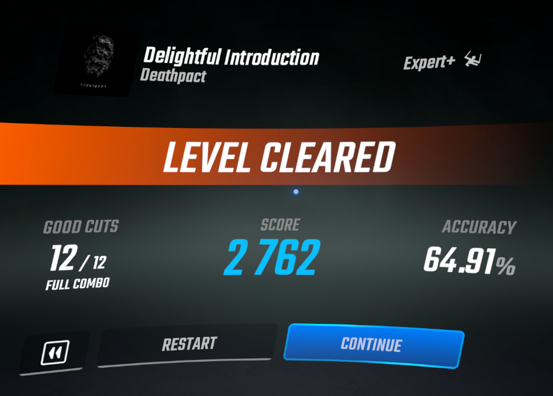

# AccuracyInResults
Replaces the rank text in the results screen with your accuracy

---

## Configuration
In-game configuration is available through the Mod Settings menu.

Accuracy header text can be changed through the `UserData/AccuracyInResults.json` configuration file.